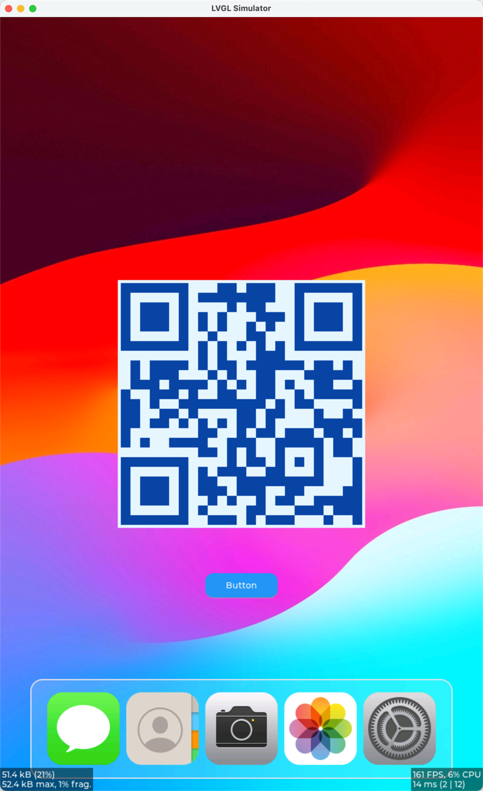

# TiPhone

## Screenshot



## Build
```bash
mkdir build && cd build
cmake .. \
  -DCMAKE_C_COMPILER=/home/hiifong/workspace/tison-pi/prebuilts/gcc/linux-x86/aarch64/gcc-linaro-6.3.1-2017.05-x86_64_aarch64-linux-gnu/bin/aarch64-linux-gnu-gcc \
  -DCMAKE_CXX_COMPILER=/home/hiifong/workspace/tison-pi/prebuilts/gcc/linux-x86/aarch64/gcc-linaro-6.3.1-2017.05-x86_64_aarch64-linux-gnu/bin/aarch64-linux-gnu-g++ \
  -DCMAKE_OSX_ARCHITECTURES=arm64
make -j $(nproc)
```

## Run
```bash
./bin/TiPhone
```
